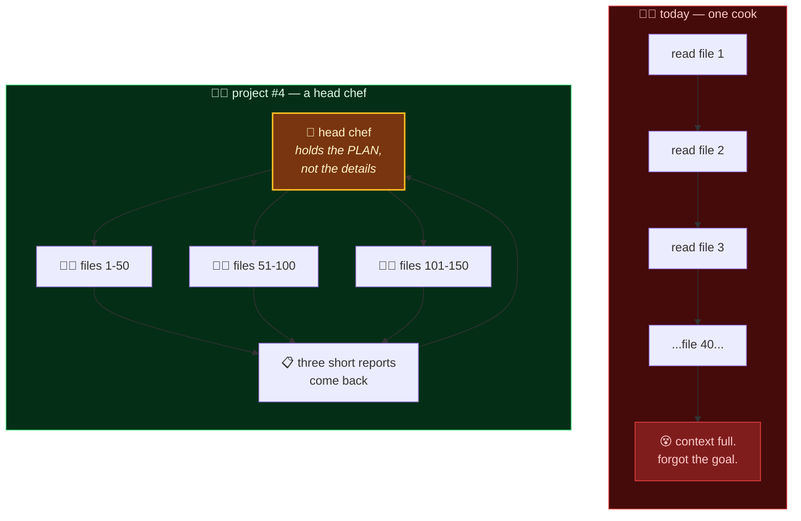

# 🧭 What's the Actual Next Step?

> A planning document, written to be argued with.
>
> **Short answer: teach the agent to hire help — and use the report card you just built to find out whether the help is any good.**

---

## Part 1 — Start with a confession

You now have an agent that stops and asks before it does something it can't undo.

Here's what it can't do: **anything big.**

Ask it to tidy your cookie jar and it's perfect. Ask it to *"go through all 200 of these files, work out which ones are stale, and clean them up"* and it will try to do all of it itself, in one long line, one file at a time, holding the entire mess in its head — and somewhere around file 40 it will forget what it was doing.

That isn't a bug you can fix with a better prompt. It's a shape problem.

### The kitchen

Think about one cook in a kitchen versus a kitchen with a head chef.

**One cook** does everything in sequence. Chop, then sauté, then plate, then wash up. For an omelette that's ideal — a second person would just get in the way. For a hundred covers it's hopeless, and not because the cook is bad. There's only one pair of hands, and by the time they get to the last dish they can't remember what the first one was supposed to be.

**A head chef** doesn't cook faster. They do something different: they split the work, hand pieces to other cooks, and keep only the *plan* in their own head instead of every detail. The details live with whoever's doing that piece.

Your agent is one cook. It's a very good cook. Project #4 is about giving it a kitchen.



The real name for this is **sub-agents**, or multi-agent orchestration. But "head chef and cooks" is the whole idea, and everything below is detail.

---

## Part 2 — Why now, and not two projects ago

Project #2's planning document put sub-agents *second* on purpose, and said why:

> *"It's the thing people build instead of the boring safety work, and it's much better built on a foundation where a regression gets caught."*

That was the right call, and now the bill comes due in your favour. You have the foundation:

| You built | Why a kitchen needs it |
|---|---|
| 📓 **The notebook** | Five cooks working at once produce five times the mess. Without a written record you cannot answer "which one did that?" |
| ✋ **The are-you-sure** | One cook asking permission is manageable. Five cooks each asking is chaos — unless the *head chef* holds the permission and asks once, on behalf of all of them. |
| 📊 **The report card** | This is the big one. **You cannot tell whether a kitchen is better than a cook by looking at it.** You need a number. |

That last row is the argument. Sub-agents *feel* impressive — lots of activity, lots of output. Whether they actually produced a better answer, or just a more expensive one, is invisible without evals.

You now have evals. So now you can find out.

---

## Part 3 — What's actually hard about it

Worth knowing before you commit, because these are the parts that eat the time.

| The hard bit | Why it bites | What to do about it |
|---|---|---|
| **Who's allowed to say yes?** | A sub-agent hits a destructive tool. Does *it* stop and ask? Then five of them are queuing for your attention. Does the head chef decide for it? Then the person approving isn't the one who saw why. | Bubble every approval up to one gate, but carry the sub-agent's reasoning with it. Your `runs` table already has a `conversation_id`; it needs a `parent_run_id`. |
| **The cost is multiplicative, not additive** | Every cook re-reads the recipe. Five sub-agents means five copies of the system prompt and tool definitions, plus a summary trip home. Project #2 showed cost is already superlinear in iterations — this multiplies that. | Measure before you celebrate. The token meter you already have, per sub-agent. Prompt caching helps a lot here and you already have it. |
| **Cooks stepping on each other** | Two sub-agents given "clean up the jar" will both eat cookies. Neither is wrong. Together they're a bug. | Split by *data*, not by *task*. "Files 1–50" is safe. "Help with the cleanup" is not. |
| **Knowing when it made things worse** | A wrong answer produced by five agents looks more authoritative than a wrong answer produced by one. | The report card. Run the same eval suite with and without delegation and compare. This is the whole reason it's project #4 and not project #3. |

---

## Part 4 — The demo that would prove it

Project #1's demo was *"roll me three d20s."* Project #2's was *"roll 3d20, then put that many cookies in the jar."* Project #3's was *"empty the jar completely"* — and watching it stop.

Project #4's should be something **one agent visibly cannot do**:

> **"Here are 60 cookie jars. Find every one that's been tampered with, and empty only those."**

One cook runs out of room somewhere around jar 20. A head chef splits it three ways, gets three short reports back, and then — this is the part that matters — **asks you once**, with a list, before emptying anything.

That single approval standing in front of three agents' worth of work is the picture project #4 is aiming at.

---

## Part 5 — What I deliberately did NOT pick

**A prettier approval UI.** Slack notifications, mobile approvals, an inbox of pending decisions. It's genuinely useful and it is genuinely not a lesson — the run is already a row in Postgres keyed by an id, so approving from somewhere else is plumbing, not learning. Build it if you want it. Don't call it project #4.

**Real auth and multi-user.** Same reasoning. Important for a product, and mostly a different subject.

**Swapping the model.** One string in `lib/agent-loop.ts`. Worth doing as an *experiment* now that you can score it — but it's an afternoon, not a project.

---

## Part 6 — What you'd be able to do afterwards

Not "understand" — *do*:

- Point an agent at a job too big for one context window and have it finish
- Say, with a number, whether delegating actually helped or just cost more
- Explain why every serious agent framework has an orchestrator, because you built one
- Debug a five-agent run from last Tuesday, because they all wrote in the same notebook

---

## Part 7 — Decisions I'd settle before starting

| Question | Suggested answer | Why |
|---|---|---|
| **Sub-agent transport** | Same `runAgentLoop`, called recursively, with its own `runId` and `parent_run_id` | You already have a loop that takes messages in and yields events out. That's a sub-agent. Don't add a framework. |
| **Approval routing** | Always bubble to the top-level run | One human, one queue. Carry the child's reason up with it. |
| **How many at once** | Hard cap, low — start at 3 | Same reasoning as `MAX_ITERATIONS`. A parallel loop with a bug isn't a hang, it's a bill times N. |
| **Model** | Keep `claude-sonnet-5` for the first pass | Changing two variables at once means learning nothing from either. Score the delegation change first; *then* try a bigger model for the head chef. |
| **Success criterion** | The existing eval suite, plus 2–3 cases that only pass with delegation | If the new cases pass and the old ones don't regress, it worked. If you can't write those cases, you don't yet know what you're building. |

---

## Part 8 — One thing worth doing before any of that

It takes an afternoon and it's the highest-value change in this repo:

**Flip the gate's default from allow to deny**, and then live with it for a day.

```ts
const DEFAULT_DECISION: GateDecision = "ask";   // was "allow"
```

You will hate it within ninety seconds. Every `roll_dice` will stop and ask. And that irritation is the actual lesson — it's exactly why the default here is `allow` and why the README argues that a gate which trains you to click "Approve" without reading is *worse than no gate at all*.

Feeling that tradeoff in your hands is worth more than reading about it. Then decide, deliberately, where your own line is — and write that decision down in `lib/approval.ts` next to the constant, so the next person knows it was a choice and not an accident.

---

## Part 9 — Decisions, settled

| Question | Decision | Why |
|---|---|---|
| **What** | **Sub-agents** — one orchestrator, several workers | It's the ceiling you actually hit, not a hypothetical one. And it's the first upgrade whose value is genuinely unmeasurable without the report card built in project #3. |
| **Repo name** | **`learn-mcp-agent-crew`** | The series reads *loop → guard → crew*. "Crew" implies a team with a leader; "swarm" implies a leaderless mass, which is the wrong shape for an orchestrator. |
| **Transport** | `runAgentLoop` called recursively, each sub-agent with its own `runId` and a new `parent_run_id` | You already have a function that takes messages in and yields events out. That *is* a sub-agent. Don't add a framework to discover that. |
| **Approvals** | Always bubble to the top-level run | One human, one queue. Carry the child's reason up with it so the approver sees why, not just what. |
| **Concurrency** | Hard cap, starting at **3** | Same logic as `MAX_ITERATIONS`. A parallel loop with a bug isn't a hang — it's a bill times N. |
| **Model** | **`claude-sonnet-5`**, unchanged | Change one variable at a time. Score the delegation change first; *then* try a bigger model for the orchestrator and score that separately. |
| **Done when** | The existing 6 evals don't regress, **and** 2–3 new cases pass that a single agent cannot | If you can't write those cases, you don't yet know what you're building. |

> ⚠️ **The one thing to verify at build time, not now:** whether delegation actually wins. Run the suite with `delegate: false` and `delegate: true` and compare both the pass rate *and* the token cost. It is entirely possible that for tasks this size, one agent is better and cheaper — and finding that out with a number would be a genuinely valuable result, not a failed project. Do not build the whole thing before checking.

---

<div align="center">

**[← Back to the README](README.md)** · **[How this was built →](BUILD_FROM_SCRATCH.md)** · **[project #2 →](https://github.com/ketankshukla/learn-mcp-agent-loop)**

*Decisions settled. Next artifact: [PROJECT_4_KICKOFF_PROMPT.md](PROJECT_4_KICKOFF_PROMPT.md).*

*The kitchen is the next thing. The report card is what will tell you if it worked.*

</div>
