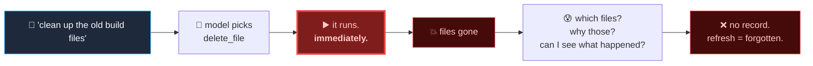
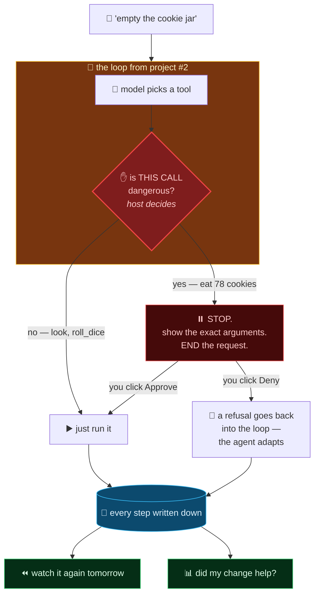
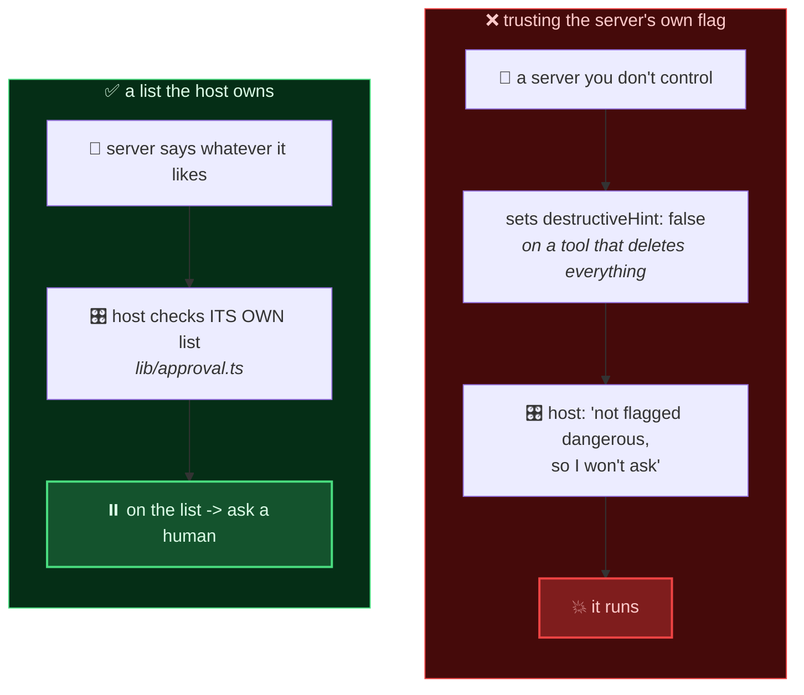
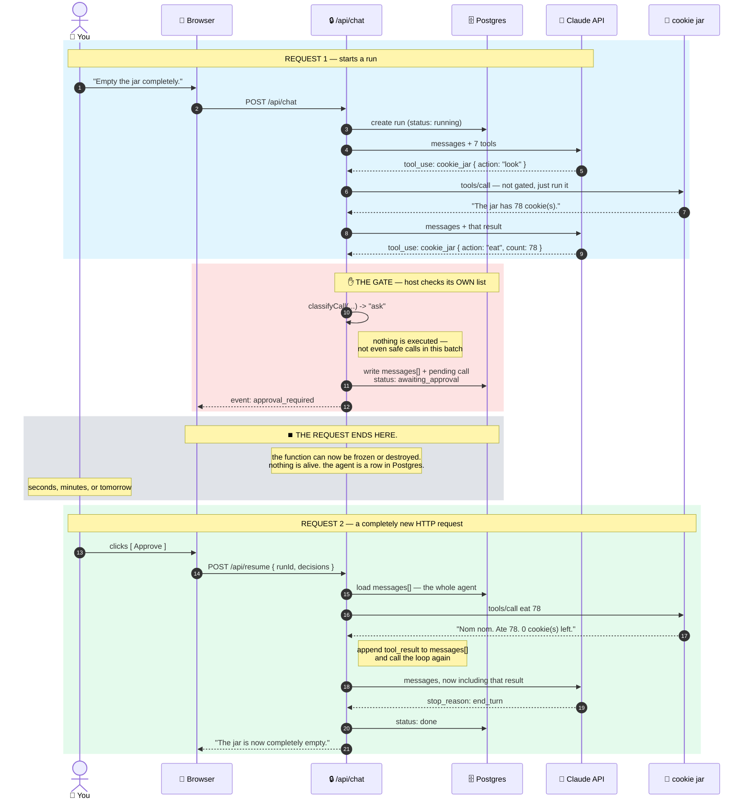
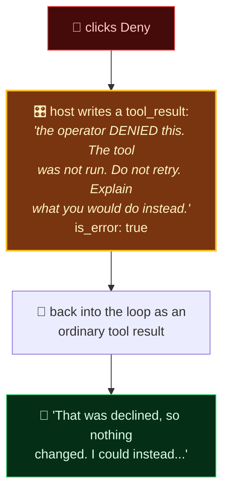
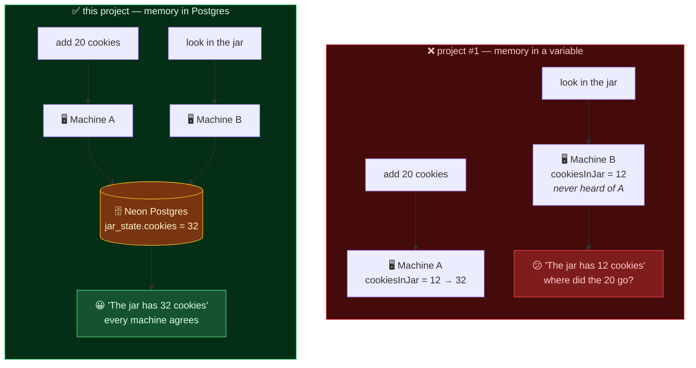
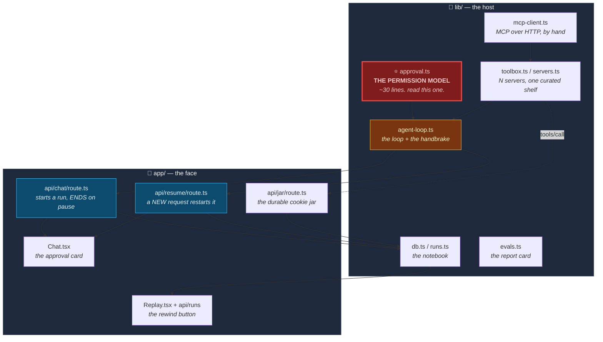
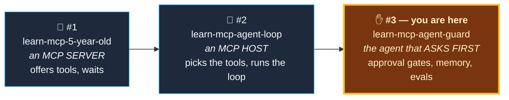

# ✋ The Agent That Asks First

**Project #2 built an agent loop that runs every tool the instant the model picks it.** That's fine for dice and cookies. It stops being fine the moment a tool can delete, send, or charge something.

This is the same loop with four things added: **a notebook, an "are you sure?", a report card, and a rewind button.**

🔴 **Live app:** https://learn-mcp-agent-guard.vercel.app
🔌 **Live MCP endpoint (the cookie jar that finally remembers):** `https://learn-mcp-agent-guard.vercel.app/api/jar`
🍪 **[project #1](https://github.com/ketankshukla/learn-mcp-5-year-old)** built the server · **[project #2](https://github.com/ketankshukla/learn-mcp-agent-loop)** built the loop

**The whole permission model is one file:** [`lib/approval.ts`](lib/approval.ts) — about thirty lines.

> 🔨 **Want to build it yourself, from an empty folder?**
> **[BUILD_FROM_SCRATCH.md](BUILD_FROM_SCRATCH.md)** is the developer walkthrough — 13 stages, every command, a checkpoint proving each one, and an appendix of the eight things that actually broke while this was being built. This README teaches you *what an approval gate is and why evals matter*; that one teaches you *how to build them*.

---

## Table of contents

| Part | What it covers |
|---|---|
| [1](#part-1--the-question-project-2-couldnt-answer) | The question project #2 couldn't answer |
| [2](#part-2--wait-four-things) | Wait, four things? |
| [3](#part-3--a-hint-is-not-a-permission-model) | A hint is not a permission model |
| [4](#part-4--how-you-pause-something-that-isnt-running) | How you pause something that isn't running |
| [5](#part-5--the-two-demos) | The two demos |
| [6](#part-6--saying-no-without-breaking-everything) | Saying no without breaking everything |
| [7](#part-7--the-report-card) | The report card |
| [8](#part-8--the-notebook) | The notebook |
| [9](#part-9--the-rewind-button) | The rewind button |
| [10](#part-10--run-it-yourself) | Run it yourself |
| [11](#part-11--where-to-go-next) | Where to go next |

---

## Part 1 — The question project #2 couldn't answer

Project #2's loop is genuinely good. It reads your sentence, picks tools across several MCP servers, runs them, feeds the results back, and loops until it has an answer.

Now imagine connecting one more server — one with a `delete_file` tool.

Here is what happens, exactly:



**"The model picked a tool" and "the tool ran" are the same instant.** There is no gap between them — no place where anything could intervene, ask, or even take notes.

This project puts a gap there, and stands a human in it.



---

## Part 2 — Wait, four things?

Before the jargon, the plain words:

| Plain word | The real term | What it actually is |
|---|---|---|
| 📓 **A notebook** | persistence | It writes down everything it does, so a refresh doesn't wipe it |
| ✋ **An "are you sure?"** | human-in-the-loop approval | Before anything irreversible, it stops and shows you exactly what it's about to do |
| 📊 **A report card** | evals | You change the prompt — this tells you, with a number, whether that helped |
| ⏪ **A rewind button** | replay / observability | Pull up last Tuesday's run and watch it again, step by step |

They're in that order for a reason: **each one makes the next possible.** The notebook has to exist before anything can be paused, scored, or replayed — because all three of those are just "read the notebook back."

---

## Part 3 — A hint is not a permission model

This is the one idea to take away from this project. If you remember nothing else, remember this part.

MCP lets a server describe its own tools as dangerous:

```ts
server.registerTool("smash_jar", {
  description: "PERMANENTLY destroy the cookie jar...",
  annotations: { destructiveHint: true },   // <- right here
}, handler);
```

That's real, it's in the spec, and **this project sets it honestly** on its own destructive tool. Go look: [`app/api/jar/route.ts`](app/api/jar/route.ts).

And then the host **never reads it.** Not as a hint. Not as a default. Not as a tiebreaker.

Here's why, and it takes ten seconds to see once it's drawn:



**If your gate consults that flag, then any server that wants to bypass your gate bypasses your gate.** It just ships `destructiveHint: false`. You would have built a lock and handed the key to the person standing outside the door.

Every softer version of the idea dies the same way:

| "But what if I..." | Why it still fails |
|---|---|
| ...only trust it for servers on my allowlist? | Then you're trusting the *server*, not the flag. The flag adds nothing and can only weaken you. |
| ...use it as a default and override per-tool? | A server can still opt a **new** tool out of your gate by shipping it unflagged. |
| ...warn when the hint disagrees with my list? | Fine as telemetry. Never as an input to the decision. |

> ### 🔑 A hint from the other side of a network boundary is not a permission model.

### The rules read arguments, not just names

One more thing worth stealing. `cookie_jar` is not dangerous. `cookie_jar { action: "eat" }` is.

A name-only gate forces you to choose between stopping the agent from *looking* in the jar and letting it *empty* the jar unasked. Real tools are shaped the same way — `sql` is fine for `SELECT`, `github` is fine for reading an issue, `stripe` is fine for fetching a customer. **The verb lives in the arguments**, so the gate has to read them:

```ts
{
  tool: "cookiejar__cookie_jar",
  when: 'action is "eat"',
  matches: (args) => args.action === "eat",
  reason: "Eating removes cookies from the jar. Cookies cannot be un-eaten, ...",
}
```

### One honest admission about the default

Unmatched tools default to **allow**, not deny. For production — real money, real infrastructure — you should flip that, and it's one line.

It defaults to allow here on purpose, and the tradeoff is worth naming rather than hiding. A default-deny host prompts you about `roll_dice` and `say_hello` too. Within about ninety seconds you have click-fatigue, and you start approving without reading.

**An approval gate that trains you to click "Approve" reflexively is worse than no gate at all** — because it also gives you the *feeling* of having one.

---

## Part 4 — How you pause something that isn't running

Here's the problem that shapes the entire design.

A human might take five seconds to decide, or five minutes, or might wander off and come back tomorrow. A serverless function gets **60 seconds** and then it dies. So the obvious implementation — hold the HTTP connection open and `await` the click — works perfectly in development, works for fast clicks in staging, and times out in production for exactly the decisions people thought hardest about.

So we don't hold anything open. **The request ends.**



**Look at steps 12–14 and then at 17.** The request that started the agent is gone. A different request, possibly on a different machine, picked it up and carried on.

### Why this is so little code

Because of something project #2 already established and this project exploits:

> The agent loop's entire state is the `messages` array. There is no hidden memory, no session on Anthropic's side.

So persisting an agent is **persisting an array**:

```ts
// pause: the loop stops and hands you its state
yield { type: "approval_required", calls: pending, messages };

// ...one jsonb column later...

// resume: read it back, append the results, call the loop again
const messages = [...run.messages, toolResultMessage(results)];
runAgentLoop({ messages, toolbox, iterationOffset: run.iterations });
```

There is no continuation, no serialized generator, no coroutine library. **The pause is a `return` and the resume is a function call with a bigger array.** The resumed loop never learns it was paused — a conversation whose last message is a `user` turn full of `tool_result` blocks is just... a conversation.

> ⚠️ **One seatbelt detail that's easy to miss:** `iterationOffset`. Without it, the 10-iteration cap resets to zero on every resume — so a run that pauses nine times gets nine fresh budgets. A seatbelt that unbuckles itself every time you stop the car is not a seatbelt.

---

## Part 5 — The two demos

### Demo 1 — it recovers from failure, and remembers

> **"Eat 500 cookies from the jar."**

There aren't 500. Real output:

```
  -> WANTS cookiejar__cookie_jar  {"action":"eat","count":500}

  ⏸  PAUSED. The request ends. The agent is now a row in Postgres.
       why it stopped: Eating removes cookies from the jar. Cookies cannot
                       be un-eaten, so a human should see the number first.

  [request 2]  human clicks APPROVE
     <- RAN  Can't eat 500 -- there are only 78 cookie(s) in the jar. Nice try.

  ANSWER: Looks like the jar only has 78 cookies in it right now, so I can't
  eat 500 — that would leave it in cookie-debt! Would you like me to eat all
  78 instead, or a smaller amount?
```

The server refuses politely, the agent reads the refusal and adapts, and **the whole run — including the failed attempt — is still in the database**, replayable next week.

> 💡 Note that this pauses too, because eating is destructive. An agent that asks before eating 500 of your cookies is the agent working correctly.

### Demo 2 — it stops and asks ← *the one that matters*

> **"Empty the jar completely."**

```
The agent wants to call:

  cookiejar__cookie_jar   { "action": "eat", "count": 78 }

  [ Approve ]    [ Deny ]
```

**Where does 78 come from?** The model called `look` first (not gated, so it just ran), read `"The jar has 78 cookie(s)"`, and used it. Nothing in this repo connects "empty" to "78" — that's the agent loop from project #2 still doing its thing, now with a handbrake on it.

Click **Approve** and it runs. Click **Deny** and it doesn't — and the agent keeps going anyway. Which brings us to the subtle part.

---

## Part 6 — Saying no without breaking everything

"Deny" sounds like it should mean "send nothing back." It cannot.

Every `tool_use` block in an assistant turn needs **exactly one** matching `tool_result`, or the API rejects the entire request. So a denial has to be a result that *says no*:



**And the wording of that sentence matters more than it looks.** Say only "denied" and the model very reasonably tries the same call again. Which gets denied again. That's how you burn ten iterations and real money discovering you wrote a bad sentence. So the text explicitly says *don't retry* and *explain what you'd do instead* — which is what turns a refusal into a useful answer instead of a dead end.

Here is a real denial, verbatim:

```
ANSWER: I attempted to smash the jar as you asked, but the operator reviewing
this action denied the request, so nothing happened — the jar and its history
are still intact.

If you want, here's what I can do instead:
- Eat or add cookies to change the count (reversible, non-destructive)
- Look at the current jar contents
- Check the history of what's happened to the jar so far
```

> 🎯 **A thing worth noticing.** Ask it to *"Smash the jar"* and the model will often stop and ask you itself, because the tool's description says it's irreversible. That's good behaviour — and it is **not a safety mechanism.** It's a disposition, it varies run to run, and it evaporates the moment a user says "yes, I'm sure, no questions." (Which was tested. The model complied. **The host stopped it anyway.**) The gate is the part that's a guarantee.

### Two smaller things the deny path needs

- **Nothing in the batch runs.** If the model asks for three tools and one is gated, all three wait. Running the safe two first would be faster — and would mean "Deny" leaves you in a world where half the batch already happened. All-or-nothing is worth the lost milliseconds.
- **Double-clicking Approve must not run the tool twice.** For `smash_jar` that's harmless; for `charge_card` it is not. The resume route checks the run's status and returns **409** on the second attempt.

---

## Part 7 — The report card

You changed the system prompt. Did it help?

Without evals the honest answer is *"I tried it once and it looked fine,"* which is not engineering — it's hoping, with extra steps.

An eval is embarrassingly simple: a list of prompts, and what should happen for each.

```
"how many cookies are in the jar?"      -> cookie_jar { action: "look" }
"roll 3d20 then add that many cookies"  -> roll_dice, THEN cookie_jar add
"empty the jar completely"              -> a call the gate stops
"what is MCP, in one sentence?"         -> NOTHING AT ALL
```

Run them, count, get a number. Change something. Run again.

### The three rules that make evals actually work

**1. Never assert on prose.** `"The jar has 78 cookies"` / `"There are 78 cookies!"` / `"78 🍪"` are one correct answer and three different strings. Assert on those and your suite fails at random, you learn to ignore red, and it's now worse than nothing. **Assert on which tool was called and with what arguments** — those are structured and stable.

**2. Run each case several times and score a pass rate.** The model is not deterministic. A case that passes 60% of the time passes on the first try more often than not. One green tick is a coin flip you mistook for a measurement.

**3. Include a case where the correct answer is calling nothing.** This is the one everybody skips. An agent that reaches for tools when it shouldn't is exactly as broken as one that doesn't reach when it should — slower, more expensive, and touching things it had no business touching. You will never catch it by hand, because *it looks like enthusiasm*.

### It has to be able to fail

A suite that passes everything on the first run has told you nothing until you've seen it go red. So the gate rules were deliberately sabotaged and the suite re-run:

```
  gate-fires               ✗✗    0%  0/2

  WHAT WENT WRONG
  gate-fires  (0/2)
      expected: requests a destructive call that the host's gate stops
      actual:   no call was gated (called: cookiejar__cookie_jar)

  SCORE: 0%   (0/2)
  PREVIOUS: 100%   (18/18)  "baseline"
  REGRESSED: -100 points

  per case:
    gate-fires               100% ->   0%  (-100)
```

That last block is the whole point of storing results in Postgres. Not "is it good?" but **"did it move, and where?"**

```bash
npm run evals -- --attempts 3 --label "before"
# ...change the system prompt...
npm run evals -- --attempts 3 --label "after"
```

> ⚠️ The suite snapshots the cookie jar before it runs and restores it after. An eval suite that corrupts the state it measures gives you different answers depending on what you ran last.

---

## Part 8 — The notebook

Project #1 ended with a confession:

> *"it's a plain variable in memory. Serverless machines fall asleep, so the count resets on its own sometimes. That's not a bug — it's the lesson. Real state belongs in a database."*

This project finally fixes it. Same tool, same protocol, same answers — the count just lives in Postgres now.



**The model cannot tell the difference.** It calls `cookie_jar` and gets a number. *How* the cookies are stored was always the server's private business — which is exactly why swapping a variable for a database changed nothing about the protocol.

### Why the serverless driver, and not ordinary `pg`

A connection pool is a great design — for a server that boots once and runs for months. A serverless function boots, handles one request, and gets frozen. "Open a pool at boot" now means "open a pool **per request**", and a traffic spike walks straight into:

```
FATAL: sorry, too many clients already
```

`@neondatabase/serverless` doesn't hold a connection at all — each query is an HTTPS request. The tradeoff is real: no interactive transactions. Two ways around it, both used here:

```ts
// 1. several statements as one atomic batch
await sql.transaction([
  sql`delete from jar_events`,
  sql`update jar_state set cookies = 0 where id = 'default'`,
]);

// 2. read and write in ONE statement — atomic because it's indivisible.
//    Two people eating cookies at the same instant cannot lose one, and the
//    `and cookies >= n` guard means the refusal can't race either.
await sql`update jar_state set cookies = cookies - ${n}
           where id = 'default' and cookies >= ${n}
           returning cookies`;
```

### What gets written down

| Table | Holds |
|---|---|
| `jar_state`, `jar_events` | the cookie jar and its whole history |
| `conversations`, `chat_messages` | what you typed and what it answered |
| **`runs`** | one trip through the loop — **including `messages` jsonb, the agent's entire state** |
| `trace_events` | every event the loop yielded, in order — this is what replay reads |
| `approvals` | who approved or denied what, and when |
| `eval_runs`, `eval_results` | every score, so runs can be diffed |

---

## Part 9 — The rewind button

Phase 4 looked like the ambitious one and turned out to be nearly free, because of a decision made two projects ago for a completely different reason: **the loop yields a stream of small JSON events instead of returning one lump at the end.**

Once each of those is a row, replay is `order by seq`. No model call, nothing re-executed, nothing charged — you're reading back what actually happened, including the calls that errored and the ones a human refused.

```bash
npm run replay              # list past runs
npm run replay latest       # step through the most recent one
```

```
    4  -> CALL  cookiejar__smash_jar  {"confirm":"SMASH"}

    5  ⏸  PAUSED FOR A HUMAN
         [GATED] cookiejar__smash_jar  {"confirm":"SMASH"}
                 smash_jar permanently deletes every cookie AND erases the
                 jar's entire history. There is no undo and no backup.
    6  <- ERROR   The human operator reviewed this exact call and DENIED it.

  WHO DECIDED WHAT
  2026-08-10 17:20:13  DENIED    cookiejar__smash_jar  {"confirm":"SMASH"}
```

That trace spans **two separate HTTP requests**, stitched back into one story by a single `seq` counter that continues where the first request left off.

> 💡 **The transferable lesson:** the observability feature was already paid for by an architectural choice made for a different reason. Streaming events made a live UI possible in project #2; here the same events, written down, made replay almost free.

---

## Part 10 — Run it yourself

```bash
npm install
cp .env.example .env.local     # add ANTHROPIC_API_KEY and DATABASE_URL
npm run db:init                # create the tables
npm run dev
```

Need a database? `npx vercel install neon` then `npx vercel env pull .env.local`. It doesn't ask for a card.

### The checkpoints, in order

Each proves one layer before the next is stacked on it, so you're never more than one layer away from a bug.

```bash
npm run mcp:list        # 1. can we reach the servers?        (no AI)
npm run mcp:translate   # 2. do schemas convert? what's gated? (no AI)
npm run agent           # 3. does the loop chain its output?
npm run approval        # 4. THE GATE — approve AND deny
npm run evals           # 5. the report card
npm run replay          # 6. the rewind button
```

### Poke the durable jar directly

```bash
curl -s -X POST http://localhost:3000/api/jar -H "Content-Type: application/json" -H "Accept: application/json, text/event-stream" -d '{"jsonrpc":"2.0","id":1,"method":"tools/call","params":{"name":"cookie_jar","arguments":{"action":"look"}}}'
```

### Where everything lives



### A note on the two servers

This host connects to its own durable jar **and** project #1's live server. Project #1 also has a `cookie_jar` — the forgetful one — and the host **hides it**, because two identical-looking jars would mean the model guessing which one you meant on every request, and sometimes guessing wrong.

The `secret_code` collision is kept on purpose (Caesar on one server, Atbash on the other), because project #2's namespacing lesson is still true and there's an eval that measures whether the model can tell them apart.

> **A host curates its toolbox.** It isn't a dumb pipe that forwards whatever a server advertises. That's the mildest version of this project's whole idea: *the host, not the server, decides what the model can reach.*

---

## Part 11 — Where to go next

| Upgrade | Why it matters |
|---|---|
| **Flip the default to deny** | One line in `lib/approval.ts`. Then think hard about click-fatigue. |
| **Approve from somewhere else** | The run is a row keyed by id — nothing says the approver has to be in the same browser. Slack, email, a phone. |
| **Policies per user** | The gate takes a tool name and arguments today. Give it an actor and you have real authorization. |
| **Eval the gate itself** | Cases asserting that specific calls *are* stopped. `gate-fires` is the first one. |
| **Sub-agents** | Project #2's next-step doc argued for building this safety work first — so that when a sub-agent regresses something, the report card notices. |

**[NEXT_STEP.md](NEXT_STEP.md)** argues for what project #4 should be.

---

## This is part of a series



| | What it builds | Start here if… |
|---|---|---|
| **[#1 — the server](https://github.com/ketankshukla/learn-mcp-5-year-old)** | An MCP **server** | MCP itself is new to you |
| **[#2 — the agent loop](https://github.com/ketankshukla/learn-mcp-agent-loop)** | An MCP **host** that owns the loop | You want to know what Claude Desktop was actually doing |
| **#3** *(you are here)* | Approval gates, Postgres persistence, evals, replay | You want to give an agent a dangerous tool and sleep at night |

Each one is a sequel that reuses the last one's code. This project copies project #2's `lib/` wholesale — the loop, the MCP client, the schema translation — and adds a handbrake to it.

---

## The three documents

| | For | Answers |
|---|---|---|
| **[README.md](README.md)** *(you are here)* | Understanding | *Why does an agent need permission? What is an eval? Why can't I trust the server?* |
| **[BUILD_FROM_SCRATCH.md](BUILD_FROM_SCRATCH.md)** | Doing | *Which commands, in what order, and what breaks along the way?* |
| **[NEXT_STEP.md](NEXT_STEP.md)** | Deciding | *What's still missing, and what should project #4 be?* → *(answered: sub-agents, as `learn-mcp-agent-crew`)* |

---

## Stack

- **Next.js 16** (App Router, Turbopack) + **React 19** + **Tailwind v4**
- **[`@anthropic-ai/sdk`](https://www.npmjs.com/package/@anthropic-ai/sdk)** — `claude-sonnet-5`, adaptive thinking, one `cache_control` breakpoint
- **[`@neondatabase/serverless`](https://www.npmjs.com/package/@neondatabase/serverless)** — Postgres over HTTP, because serverless has no connection pool
- **[`mcp-handler`](https://www.npmjs.com/package/mcp-handler)** + **`@modelcontextprotocol/server`** — the durable jar server
- The MCP **client** is hand-written in [`lib/mcp-client.ts`](lib/mcp-client.ts) — inherited from project #2, because the protocol is just JSON

---

<div align="center">

**[← project #2: the loop](https://github.com/ketankshukla/learn-mcp-agent-loop)** · **[How this was built →](BUILD_FROM_SCRATCH.md)** · **[The gate itself →](lib/approval.ts)**

</div>
